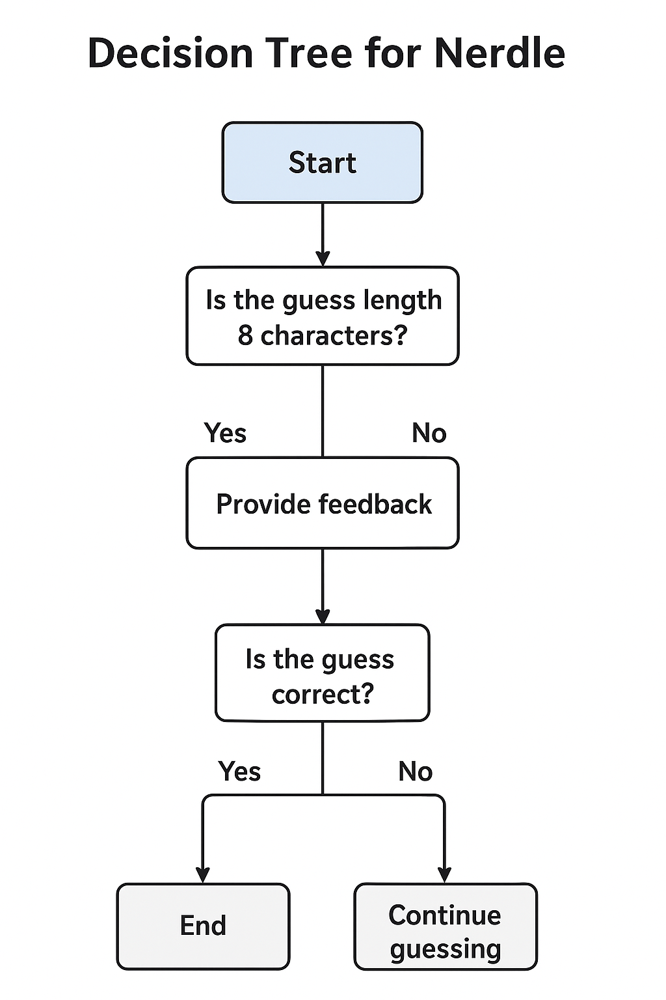

# Nerdle (Math Wordle)

Small terminal-based clone of Wordle using 8-character math equations instead of words.

## Summary

This project implements a terminal Nerdle game where the player has 6 attempts to guess a valid, 8-character math equation (examples: `12+34=46`, `3*34=102`). Each guess receives color-coded feedback per character:

- Green: correct character in correct position
- Yellow: character exists in the equation but in a different position
- Gray: character not present in the equation

The codebase contains:

- `nerdle.py` — main CLI and game loop
- `game_engine.py` — game logic, feedback formatting, validation helpers
- `equation_generator.py` — random, valid 8-character equation generation and validation
- `tests/` — unit tests

## Requirements

- Python 3.8+
- (No additional packages required)

## Quick start

Run the game from the project root:

```bash
python3 nerdle.py
```

Run the test suite (from project root):

```bash
pytest -q
```

## How to play

- The target is always exactly 8 characters.
- Valid characters: `0123456789+-*/=` (exactly one `=` in a valid guess).
- You have 6 attempts to find the correct equation.
- After each guess you'll see colored feedback. If your terminal doesn't support colors, the game still works — the `game_engine` provides a plain-text formatter for tests.

Example rules enforced by the game:

- Guess length must be exactly 8 characters.
- The guess must be a mathematically-correct equation (right-hand side equals the left-hand side expression).
- Exactly one `=` is required.

## Play example (visual)

Assume the hidden target equation is:

	12+34=46

You guess:

	15+35=50

Feedback (colored in the terminal) will indicate per-character correctness. In plain-text the same feedback could be shown like:

[1G][5B][+G][3Y][5B][=G][5B][0B]

Interpretation:

- `1G`: the `1` is correct and in the correct position (Green)
- `5B`: the `5` is not in the target equation (Gray/Black)
- `+G`: the `+` is correct and in the correct position
- `3Y`: the `3` exists somewhere in the target but not at that position (Yellow)
- `=G`: the equals sign is correct and in the correct position

Continue guessing until you either find the exact equation (all Greens) or run out of attempts.

## Decision tree

If you have a decision-tree diagram that explains the game's logic (suggested file name `nerdle-decs.png`), place it in the project root and it will be displayed below:



If the image file is not present, the link above will be shown as broken in some viewers — add `nerdle-decs.png` to the repository root (or adjust the path) to have it render in the README.

Tip: a PNG at around 1200×800 px or an SVG exported to PNG at comparable size works well for readability on GitHub and in terminals that show images.

## Notes for contributors

- Tests are in the `tests/` folder. Please run them before opening PRs.
- Keep equations exactly 8 characters long — the generator and the validator assume that length throughout the codebase.

## Troubleshooting

- If you see weird characters instead of colors, your terminal might not support ANSI color escape sequences. The game will still run; focus on the plain indicators (G/Y/B) when reading test output.

## Contact / License

This is a small educational project. Feel free to open issues or PRs on the repository for improvements.

Have fun and good luck!
